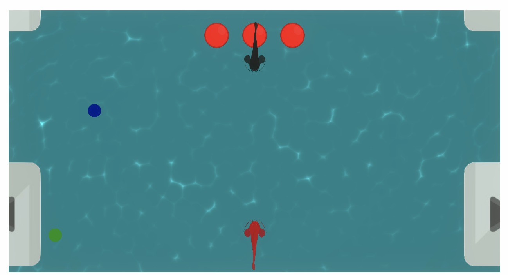

# fishgame2
An attempt to develop a multiplayer game that players try to bite each others tail. Unfinished.
Basically there are health bars and three types of buffs (speed, health, size change) in this game. Moreover, biting the tail of the fish reduces health of the victim fish.

Collaborated with Burak Payzun using Unity Collaborate.

